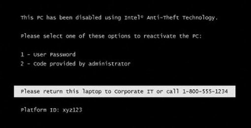

# 💻 Recuperación de BIOS ASUS K56CB con programador CH341A

Este proyecto documenta la recuperación completa de un portátil ASUS K56CB bloqueado (brickeado) utilizando un programador CH341A y un clip SOP8.  
Tras un fallo en la actualización de BIOS, el portátil quedó completamente inoperativo — pantalla en negro, sin retroiluminación, sin POST.  
Al no existir opciones de recuperación internas, se reescribió manualmente la BIOS directamente sobre el chip SPI.

---

## 🧰 Herramientas y hardware utilizado

- Programador USB CH341A (edición negra)
- Clip SOP8 con cable
- Software CH341A Programmer (v1.34 o AsProgrammer)
- UEFITool (para análisis de BIOS)
- Archivo `.bin` verificado de 8MB (chip W25Q64FV)
- Flux y pinzas (opcional, para mejor contacto)

---

## 🛠️ Proceso de recuperación paso a paso

### 1. Identificar el chip BIOS  
Localizado el chip SPI de 8 pines en la placa base (Winbond W25Q64FV — 8MB).

### 2. Conectar el clip al chip  
- Alinear el pin 1 del clip SOP8 (cable rojo) con el pin 1 del chip (muesca o punto en la esquina).
- Conectar el clip al CH341A mediante el adaptador.

### 3. Leer y guardar una copia de seguridad  
- Abrir CH341A Programmer → Leer → Guardar como `bios_backup.bin`
- **Siempre haz una copia de seguridad antes de flashear.**

### 4. Conseguir o extraer una BIOS válida  
- **No usar archivos `.209` de ASUS directamente** (no son dumps completos).
- Verificar estructura con UEFITool:
  - Debe contener Descriptor Region + ME Region + BIOS Region.
- El tamaño debe ser exactamente **8.388.608 bytes (8MB)**.

### 5. Flashear la nueva BIOS  
- Borrar → Cargar archivo `.bin` → Programar → Verificar
- Todos los pasos deben mostrar “success” o “completado con éxito”.

### 6. Montar y encender  
- Desconectar el clip y el programador.
- (Opcional) Resetear CMOS quitando la pila 30 segundos.
- Encender el portátil: debería arrancar directamente en la BIOS.

---

## ✅ Resultado

La BIOS se flasheó correctamente.  
El portátil ahora arranca sin problemas y funciona al 100 %.  
Este proceso lo rescató del contenedor… y por menos de 10 € en herramientas.

---

## 📷 Imágenes

Consulta la carpeta `/images` para fotos detalladas del proceso y capturas del software.

---

## 📁 Archivos incluidos

- `bios_backup.bin` → Dump original de seguridad
- `K56CB_fixed.bin` → BIOS limpia utilizada para recuperar
- Enlaces de herramientas y utilidades en `/tools`

---

## 📎 Enlaces útiles

- [UEFITool (GitHub)](https://github.com/LongSoft/UEFITool)
- [Herramientas CH341A](https://github.com/nofeletru/UsbAsp-flash/wiki/CH341A)
- [Foro Win-Raid (BIOS dumps)](https://winraid.level1techs.com/)
- [BIOS-Mods.com](https://www.bios-mods.com/)

---

## 🧠 Lecciones aprendidas

- Haz siempre un backup de tu BIOS antes de tocar nada.
- No flashees archivos `.209` con CH341A — están incompletos.
- Con un programador de 10 € y algo de paciencia se pueden salvar muchos equipos.
- Como apenas hay documentación clara, decidí crear la mía.

---

## 📇 Autor

Reparación y documentación realizada por [@kiz4ru](https://github.com/kiz4ru)  
Si te ha sido útil, considera dejar una ⭐️ al repositorio.
